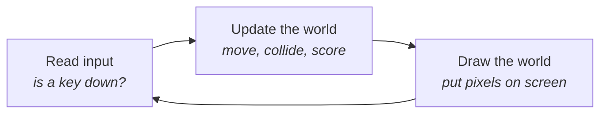
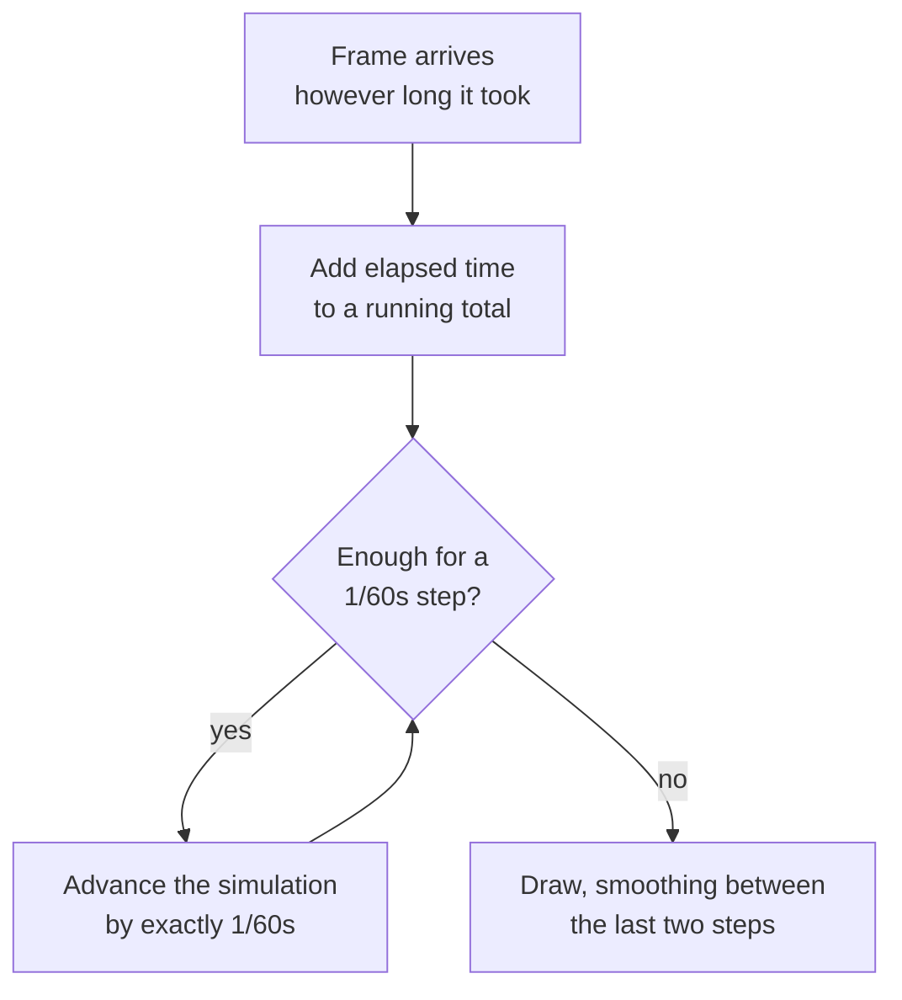
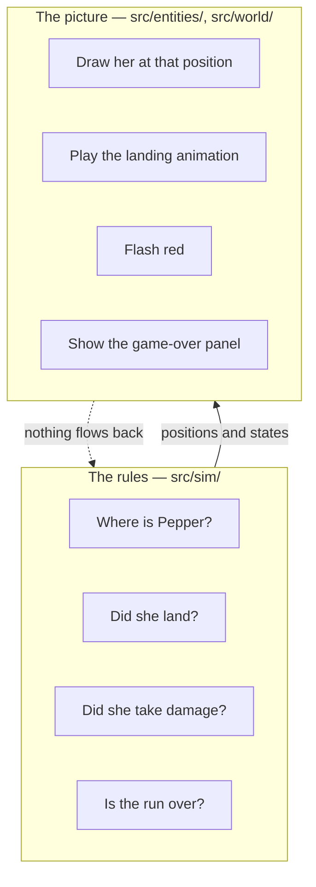
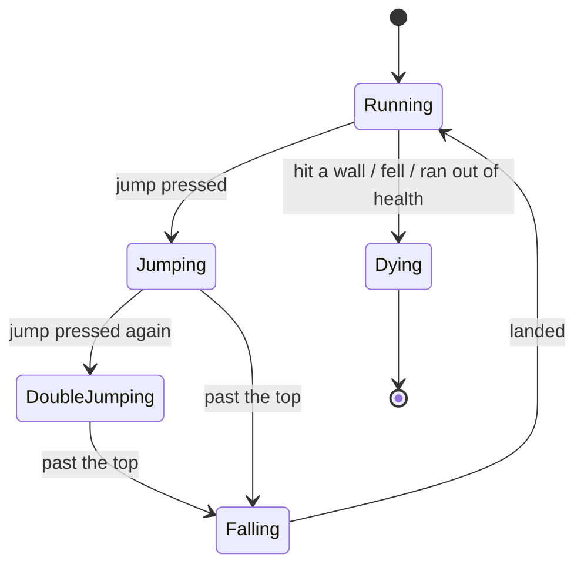
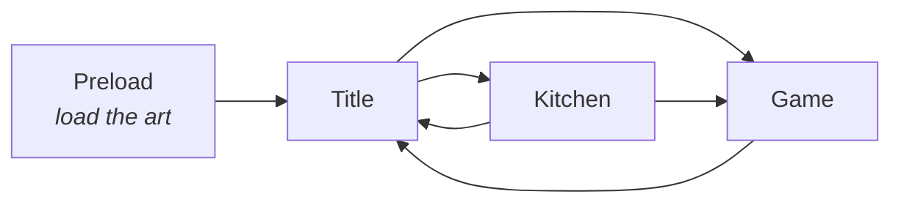

# 3. How a 2D game works

Written for designers. You do not need to read code to follow this, and there is no code to
copy. Files are named so you can go and look at the evidence if you want it, but every idea here
stands on its own.

The claim of this document is simple: **a 2D game is a small number of parts, and if you know
what they are you can plan one.**

## The loop

A game is a program that never finishes. It does three things, over and over, about sixty times
a second:

Everything else is detail hung off those three steps. Each pass is a **frame**, and at 60 frames
per second you have about **16 milliseconds** to do all three. Go over budget and the game
stutters.

The important consequence for a designer: **nothing in a game is continuous.** A jump is not a
smooth arc, it is 51 discrete positions. Two things touching is a test performed at instants,
which is why a fast object can pass through a wall between two frames without ever being inside
it.

## Why the clock has to be separate from the picture

Here is a real bug from the original game, and the single most important technical idea in this
document.

The original moved Pepper vertically **once per drawn frame**, with no reference to how much time
had passed. On a 60 Hz monitor that gives the intended jump. On a 144 Hz monitor the code runs
144 times a second instead of 60, so gravity applies more than twice as often — and Pepper's jump
becomes a hop. **The game played differently on different monitors.** Not "looked" differently.
*Played.*

The fix is to separate the two clocks:

The **simulation** always advances in identical fixed slices. The **drawing** happens whenever
the display is ready. A fast monitor draws more often; it does not think more often. Gravity is
the same everywhere.

> **What a designer should take from this:** your tuning values are only meaningful if the
> simulation clock is fixed. Otherwise "jump height" is not a property of your game, it is a
> property of the player's hardware.

*In this project:* [`src/sim/FixedStepper.ts`](../src/sim/FixedStepper.ts).

There is a second reason to care. If the game is paused for two seconds — a background tab, a
laptop lid — should it then simulate two seconds of missed hazards at high speed? Almost never.
This project drops the backlog and resumes in real time, so you do not return to find you died
during lunch.

## The split that matters most

The single most useful structural decision here: **the rules of the game are kept separate from
what it looks like.**

The rules do not know a screen exists. They compute positions and states; something else decides
what those look like. The arrow only goes one way.

Why a designer should care:

- **The rules can be tested without running the game.** This project verifies its jump height by
  arithmetic in under a second. No browser, no waiting, no looking.
- **You can change the look without touching the game.** Reskinning risks nothing.
- **Bugs have an address.** "Pepper died unfairly" is a rules problem. "Pepper died and the
  animation was wrong" is a picture problem. You know which conversation to have.
- **The rules become readable.** [`src/sim/Runner.ts`](../src/sim/Runner.ts) is the player as a
  designer thinks of one: a position, a velocity, a state, some health.

## Where things are: coordinates

Every object has a position measured from an **origin**. Two conventions exist and they disagree
about which way is up: most 2D frameworks put the origin at the top-left with Y increasing
*downward*; this game — like the original — puts it at the bottom-left with Y increasing
*upward*, so "higher" means a bigger number.

Neither is right. What matters is picking one and stating it, because mixing them silently
inverts your gravity.

Each sprite also has its own **anchor** — the point that its position refers to. Pepper is
positioned by her **feet**, because a runner is defined by what she is standing on. Getting this
wrong makes characters hover or sink.

There are two spaces to keep distinct:

- **World space** — where things are in the level. Pepper is 12,400 units into the run.
- **Screen space** — where things are on the display. Pepper is 147 pixels from the left edge.

The camera is the translation between them. UI lives in screen space and ignores the camera
entirely, which is why the score stays in the corner while the world slides past.

## Sprites, atlases and animation

A **sprite** is an image drawn at a position. An **animation** is a list of images shown in
sequence with a duration for each.

This project transcribes the original's timings exactly:

| Animation | Frames | Seconds per frame | Playback |
|---|---|---|---|
| Pepper run | 10 | 0.079 | loop |
| Pepper jump | 3 | 0.144 | out and back |
| Pepper fall | 3 | 0.14 | out and back |
| Pepper attack | 7 | 0.075 | once |
| Pepper idle | 4 | 0.13 | out and back |
| Carrot run | 10 | **0.059** | loop |

Note Carrot's run is faster than Pepper's — a small cat takes quicker steps. That is a deliberate
piece of character animation, and it survived the port because someone wrote it down.

### Why art gets packed into an atlas

Sending an image to the graphics card is cheap. *Switching* between images is expensive. Drawing
a hundred sprites from a hundred separate files means a hundred switches; drawing them from one
combined image means one.

So at build time, all 140 sprite files are packed into a couple of large sheets called a
**texture atlas**, with a data file recording where each frame ended up. The game ships the
sheets, not the loose files.

The original made an instructive mistake here. Its atlas was packed without regard to grouping,
so a single run cycle was split across three different sheets — meaning the most frequently drawn
animation in the game forced a switch on nearly every frame. **Pack related frames together.**

> **For designers:** hand your programmer loose, well-named source files (`pepper_run_01.png`)
> and let the build combine them. Never hand over a hand-assembled sheet; you will want to change
> one frame later.

*In this project:* [`scripts/pack-atlas.ts`](../scripts/pack-atlas.ts), which also trims
transparent margins — worthwhile when thirty of your frames are 380×380 squares containing a
character who fills half of one.

## Levels made of tiles

Rather than one enormous image, levels are built from a grid of small square **tiles** — here,
95×95 pixels. A level is then a spreadsheet of numbers saying which tile goes in which cell.

This is compact, editable, and gives you collision almost free: the game already knows which
cells are solid.

Levels were authored in **[Tiled](https://www.mapeditor.org/)**, the standard free tile editor.
Its files are the design source; a build step converts them into something the game loads.

The original did something clever worth copying. Enemies, potions, ingredients and hazards are
**not** placed as separate objects — they are tiles on hidden layers, where each tile type
carries properties like `type: enemy`, `name: spider`, or `obstacle: deadly`. The designer paints
enemies exactly the way they paint scenery, and the game reads the properties to decide what to
spawn.

> **For designers:** this means your level editor is the only tool you need. Painting a spider is
> the same gesture as painting a brick.

## Collision

Two questions, constantly: *are these two things touching?* and *what should happen?*

Nearly every 2D game answers the first with **boxes**. Not the character's outline — a rectangle
approximating it. Pepper's sprite is 380 pixels tall; the box that collides is 115×208 and sits
inside her. This is standard, and generous: a hitbox slightly smaller than the character makes a
game feel fair, because near-misses read as misses.

Two ideas do most of the work in a runner:

**One-way platforms.** You can jump *up through* a platform and land on top of it, but not fall
through it from above. Nearly every platformer does this, because the alternative — bonking your
head on every ledge — feels terrible. It is achieved by only registering a landing when the
player is moving *downward* and their feet cross the surface.

**Sweeping.** Testing only "where is she now" misses fast movement: at full falling speed Pepper
covers 26 pixels between frames and can pass clean through a platform. The fix is to test the
whole path travelled since the last frame, not just the endpoint. The original never solved this
and instead capped falling speed so it could not happen — a workaround its author labelled with a
`FIXME`.

*In this project:* [`src/sim/collision.ts`](../src/sim/collision.ts).

## The camera

The camera decides what the player can see, and it is a genuine design tool rather than
plumbing.

It rarely follows the character exactly — that produces nauseating jitter on every small
movement. It lags, smooths, and often deliberately looks *ahead* of where the player is going.

A real note from this project's playtesting:

> *"The camera is currently too close to the character and we cannot see the floor or gap when we
> are dropping from height."*

Landing was guesswork, because the player could not see where they would land. The fix was to
show more of the world and bias the view *downward while falling*. **A camera that hides the
information a decision needs makes the game unfair,** however good the physics underneath.

## State machines

A character is usually in exactly one **state** at a time, with defined transitions:

This is worth drawing on paper before anyone writes anything. It tells you which animations you
need, which transitions must feel good, and where the rules live.

It also exposes design decisions. In the original you could only double-jump while *still
rising* — step off a ledge, or pass the top of your jump, and your second jump was gone. Players
read that as a bug rather than a rule. Here, an air jump is available whenever you have one left.
One arrow on the diagram; a large difference in how the game feels.

## Remembering things between sessions

Best distance, upgrades, whether the sound is muted — these outlive the browser tab, stored on
the player's own machine.

The one thing designers should know: **your save format will change**, because you will add
features. If version 2 of your game cannot read a version 1 save, your most loyal players — the
ones with the most to lose — are the ones you punish. So a save carries a version number and the
game knows how to upgrade an old one.

This project's saves went from version 1 to 2 when the kitchen was added. Old saves keep their
best distance. *In this project:* [`src/save/store.ts`](../src/save/store.ts).

## Screens

Games are organised into **scenes** — self-contained screens with their own contents:

Loading is its own scene because art takes time to arrive and the player needs to see something
while it does. There is a subtlety worth knowing: a framework may **reuse** a scene object when
you return to it while destroying everything it drew. Assuming otherwise caused a crash in this
project the second time anyone opened the kitchen.

## Sound

The original shipped **no audio at all** — not a single file. It is the most common thing to run
out of time for, and it costs more than it looks: sound is most of what makes a jump feel like a
jump.

A minimum set is small: jump, land, take damage, collect, cast, die, and something underneath it
all. Plus a mute button that is remembered.

## The parts list

Everything above, as a checklist:

| Part | Its job |
|---|---|
| Game loop | Input, update, draw — 60× a second |
| Fixed timestep | Same physics on every machine |
| Rules layer | The game, without a picture |
| View layer | Drawing what the rules computed |
| Sprites and animation | Images over time |
| Texture atlas | Packing art so drawing is fast |
| Tilemap | Levels as a grid, authored in an editor |
| Collision | What is touching what, and what that means |
| Camera | What the player can see |
| State machine | What a character is doing |
| Save data | What survives the tab closing |
| Scenes | Screens and the routes between them |
| Audio | Feedback you hear |

---

Next: [4. How a runner works](4-how-a-runner-works.md) — what this genre does differently.
