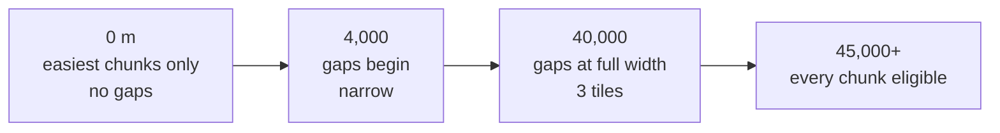
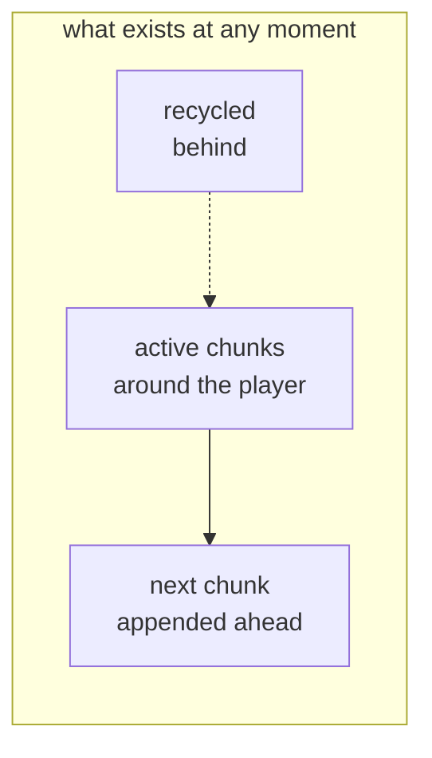

# 4. How a runner works

An endless runner is one of the most constrained forms in games, and the constraint is the point.
This document is about what those constraints do to your job as a designer.

## The contract

**The player does not control movement forward. They only control jumping.**

That is the genre. Everything follows from it.

Because forward motion is automatic and constant, you cannot design a challenge around *going
somewhere*. The player is always going there. The only decision available is **when to press**,
and the only skill is timing.

So the design pressure moves entirely into two places:

1. **What is in front of the player** — the layout.
2. **When they can see it** — the pacing.

A platformer designer can ask "how do I make this jump interesting?" A runner designer asks "how
do I make the *timing* of this jump interesting?", because the jump itself is always the same
jump.

> **The upside:** this is why runners are a superb first game. There is exactly one verb. You can
> make it feel excellent, and then the entire rest of the project is content and systems rather
> than more mechanics.

## Two ways to build the same picture

There is a choice here that looks purely technical and is not.

**Move the world past a stationary player.** Pepper stays pinned 147 pixels from the left edge
and the level slides leftward at 400 pixels per second. This is what the original did.

**Move the player through a stationary world.** Pepper genuinely travels; the camera follows.
This is what this version does.

On screen they are indistinguishable. The difference is what happens to your level data. In the
first, every object's position must be changed every frame — the world is in constant motion. In
the second, a level chunk is placed once and never touched again, and "how far have I gone?" is
simply Pepper's position.

The moment you want *endless* content — pieces appended ahead and recycled behind — the second
approach is dramatically simpler. The original never needed it, because the original was not
actually endless.

## The jump envelope is your unit of level design

This is the most important idea in the document. **Measure your jump, then design everything
against that measurement.**

Pepper's jump, precisely:

| | Single jump | With the second jump |
|---|---|---|
| Rises to | **325 px** | **≈ 650 px** |
| Airtime | **≈ 0.85 s** | **≈ 1.5 s** |
| Horizontal reach | **≈ 340 px** | **≈ 600 px** |
| In tiles (95 px each) | **≈ 3.6** | **≈ 6.3** |

*(Measured by running the simulation, not calculated — the second jump is taken at the apex.)*

Those numbers are the physical limits of your level. Every gap, every obstacle, every platform
height must sit inside them — not approximately, but with margin.

The widest gap this game will ever generate is **3 tiles, 285 pixels**, against a jump that
covers 340. That 55-pixel margin is deliberate. A gap that is exactly clearable is only clearable
by a player who jumps at exactly the right pixel, and *feels* like a trap even when cleared.

Platform faces are one tile — 95 pixels — against a 325-pixel rise. Wildly inside the envelope,
so hitting one is unambiguously a mistake the player made rather than a demand they could not
meet.

> **For designers:** write your envelope on a card and pin it up. "Max gap 3 tiles, max step 1
> tile." Every layout decision is checked against it. This is the runner equivalent of a
> grid — and it is why the jump must be tuned *before* any level is authored, not after.

## The reaction budget

The player can only respond to what they have seen. So how long do they get?

The view is about 1,456 pixels wide and Pepper sits 147 pixels from the left, so roughly
**1,300 pixels of world** are visible ahead of her. At 400 pixels per second, that is
**about 3.3 seconds** of warning.

Three seconds sounds generous, but it is the budget for *everything*: seeing the obstacle,
recognising what it is, deciding, and pressing. Human reaction to an expected visual cue is
around 250 ms; to something that must be identified first, considerably more.

Two consequences:

- **Obstacles must be readable at a glance.** Not "detailed" — *distinguishable*. Deadly green
  sludge must not resemble decorative green scenery.
- **Speeding the game up eats the budget.** This game's Time Distortion spell accelerates the
  world to 2.8× — which cuts the warning to under 1.2 seconds. That is precisely why it is a
  *player-triggered* effect. The player chose to make the game harder, and knows it.

## Forgiveness is a feature

The single biggest difference between the original and this version is not visible in a
screenshot.

The original had **no input forgiveness at all**. Miss the ledge by one frame — a sixtieth of a
second — and you were falling with no recourse.

Two standard techniques fix this:

**Coyote time** (0.1 s here). For a heartbeat after walking off a ledge, a jump still works. Named
for the cartoon coyote who stands on air until he looks down. Players believe they jumped from
the ledge; the game agrees.

**Jump buffering** (0.12 s here). A jump pressed slightly *before* landing is remembered and fires
the instant the character touches down, rather than being discarded.

Both make the game objectively easier. Both are almost universally described by players as the
game feeling *more responsive* rather than easier — because they remove failures the player did
not believe they had earned.

> **These are not bug fixes. They are design.** Budget for them, and tune them by feel. Both
> numbers here were arrived at by playing, not by calculation.

## Failure has to be legible

When a player dies, they must know why within a fraction of a second — otherwise the death feels
arbitrary and they blame the game.

This project uses one rule, applied without exception:

> **Hearts are for things that hit *you*. Geometry is for things *you* hit.**

- Touched by a fly or spider → lose a heart. Recoverable, five chances.
- Fell down a pit → dead. Ran into a wall → dead. Immediately, regardless of health.
- Touched the green sludge → dead. It does six damage against five hearts, so it is lethal
  whatever your health.

That last one is inherited from the original and kept deliberately, because it is what makes the
sludge read as *poison* rather than as another enemy. A hazard that sometimes kills you is a
hazard players will gamble against.

The rule also settles arguments in advance. When permanent upgrades were added, one grants a
ghost that absorbs a hit — and the immediate question was whether it should absorb poison. No:
poison is the game's one unambiguous threat, and softening it would blunt the only thing that is
never negotiable.

## Difficulty is a curve, not a list

The original's difficulty was a hand-written list of level segments, growing from five to nine.
It was authored, finite, and identical on every play.

An endless game needs difficulty as a **function of distance**:

Three separate ramps, deliberately not synchronised:

- **Which level pieces appear.** A ceiling that rises with distance. Early on only the gentlest
  pieces are eligible; by 45,000 units anything can appear.
- **Whether floors have gaps.** None at all before 4,000 units — the opening should teach, not
  test.
- **How wide those gaps are.** Growing to the 3-tile maximum by 40,000.

Two details stop this feeling mechanical:

**A couple of easy pieces stay eligible forever.** Without this, difficulty becomes a wall and
every late run feels identical. With it, the game still breathes.

**The same piece never appears twice in a row.** The cheapest possible fix for the "wait, I have
seen this" feeling.

Selection is weighted toward the current target rather than picked flatly from everything
allowed — otherwise the easiest piece, always eligible, would dominate forever.

*In this project:* [`src/world/selector.ts`](../src/world/selector.ts) and the gap constants in
[`src/config/constants.ts`](../src/config/constants.ts).

## Endless content from seven levels

The original shipped eight hand-authored maps and played them in a fixed order. This version
draws from the same eight, forever.

Only a window of level exists at once: a few thousand units ahead, rather less behind. As Pepper
advances, a new piece is appended in front and pieces behind are recycled — the same objects
reused rather than thrown away and rebuilt, which is what keeps the frame rate steady.

The player experiences an endless cellar. The game holds a few hundred metres of it.

> **For designers:** this is the leverage. Eight well-made pieces plus a good selector produce
> more play than twenty pieces in a fixed order. Spend your effort on making each piece
> *composable* — able to follow anything and be followed by anything — rather than on making more
> of them.

## Validating levels automatically

If levels are assembled by machine, the machine can generate something impossible. A gap wider
than the jump is not a difficulty spike; it is a dead end.

So this project has an **autopilot** — a bot that plays the game, jumping where the course
requires it. It runs against generated courses, and a course it cannot clear is a failing test
rather than a furious player.

It earned its keep immediately by finding three genuine design flaws:

1. **Gaps were placed without looking up.** The safe-window analysis checked that the floor was
   clear but not what was *above* it, so a gap could appear under a low shelf — nowhere to jump.
2. **The wall test ignored the player's height.** It asked whether Pepper could get *over* an
   obstacle without accounting for the fact that she is 208 units tall.
3. **Air jumps aimed at shelves that could not be reached.** The bot would spend its second jump
   reaching for a platform outside the envelope, and fall.

Every one of these would have shipped. None would have been caught by a unit test, because each
was about the *interaction* of correct pieces.

> **For designers:** if any part of your content is generated, build something that plays it. It
> does not need to play well — it needs to play *at all*, and to complain when it cannot.

You can watch it: add `?autopilot=1` to the game's URL.

## The runner checklist

- [ ] Tune the jump first. Nothing else can be designed until it exists.
- [ ] Write down the envelope: apex, airtime, horizontal reach, in tiles.
- [ ] Set maximum gap and step from the envelope, with margin.
- [ ] Calculate the reaction budget — visible distance ÷ speed.
- [ ] Make every hazard readable at a glance and distinct from scenery.
- [ ] Add coyote time and jump buffering. Tune by feel.
- [ ] Pick one failure vocabulary and never break it.
- [ ] Make difficulty a function of distance, on several unsynchronised ramps.
- [ ] Keep some easy content eligible forever.
- [ ] Never repeat a piece back to back.
- [ ] If content is generated, build a bot that plays it.

---

Next: [5. Designing your own](5-designing-your-own.md) — assets, systems, and how to break the work up.
