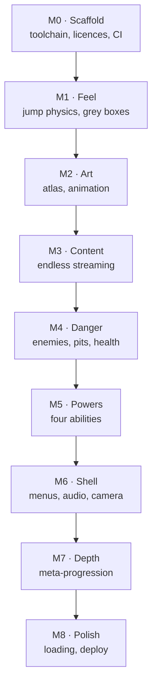

# 5. Designing your own

The practical document. What you must prepare, what must be built, in what order, and where to
read next.

The checklists below are not idealised — they are the actual contents of this repository, which
is a finished, shipped 2D runner. If you prepare this much, you have enough.

## What art you actually need

The complete inventory of this game:

| Category | Count | What it is |
|---|---|---|
| Character sprites | **140 files** | Every frame of every animation, for every character and enemy |
| Tilesets | 5 | The building blocks levels are painted from |
| Backdrops | 7 | Full-screen background images |
| Levels | 8 | Tiled maps |
| Bitmap fonts | 8 files | 4 fonts, each an image plus a data file |
| Particle effects | 3 | Sparks, clouds, circles |
| Audio | **0** | The original shipped none. See below. |

That is a complete commercial-looking game. It is less than most people expect.

### The character animation set

This is the part designers most often under-scope. One player character needs **every state the
game can be in**:

| State | Frames here | Why it exists |
|---|---|---|
| Idle | 4 | Standing on the title screen, waiting |
| Run | 10 | The default |
| Jump | 3 | Rising |
| Double jump | 2 | The second jump must look different or it reads as a glitch |
| Fall | 3 | Descending |
| Hit | 1 | Taking damage |
| Attack | 7 | Casting |

**Seven states, thirty frames, for one character.** Then the companion (Carrot) needs the same
set minus attack. Budget accordingly: a character is not one drawing.

Look again at the state machine in [document 3](3-how-a-2d-game-works.md#state-machines) — it
*is* your animation list. Draw the diagram, count the boxes, and you know what to commission.

### Enemies

Each enemy needs **idle** and **death**. Here: 3 idle frames and 6 death frames each.

The death animation being twice as long as the idle is not an accident. Killing something is the
reward, so it gets the frames.

### Everything else

- **Pickups** — 4 potion colours, 3 ingredients, plus a shared 9-frame sparkle drawn behind
  every collectible so pickups catch the eye against a busy background.
- **Tilesets** — separated by purpose: scenery, enemies, potions, ingredients. Remember that
  enemies and hazards are *painted as tiles*, so they need tileset entries as well as sprites.
- **Backdrops** — one per environment, scrolled slowly for parallax.
- **UI** — panels, buttons, hearts (full *and* empty), ability buttons, energy indicators.
  Panels and buttons are **9-patch**: images with defined stretchable middles so one button
  image serves every size of button. Ask for these specifically; they are not the same as a flat
  image.
- **Fonts** — a caution learned here. Bitmap fonts are images of characters, and these contain
  **only ASCII**. The moment you want French accents or any non-Latin script, they must be
  regenerated. Decide about localisation before commissioning fonts.
- **Icons** — favicon, app icons, a social preview image.

### Audio — the thing that gets cut

The original shipped **zero** audio files. It is the most commonly abandoned category, and it
costs more than its size suggests: sound is most of what makes a jump feel like a jump.

The minimum: jump, land, damage, collect, cast, die, and something underneath. Plus a mute
toggle that is remembered. This project synthesises its cues in code rather than shipping files —
a legitimate way to have *something* when you have no budget.

> **The asset lesson:** write the list before you commission anything. The expensive discovery is
> reaching the end of a project and finding you have a beautiful run cycle and no death
> animation.

## What systems must be built

Independent of genre, a 2D game needs roughly this. Use it to sanity-check a plan or a quote.

| System | What it does | Skip it if… |
|---|---|---|
| Game loop and fixed timestep | Runs everything, consistently on every machine | Never |
| Input | Keyboard, touch, gamepad | Never |
| Rules layer | The game itself, separate from drawing | Never — this is the one that pays off |
| Rendering and animation | Draws what the rules computed | Never |
| Asset pipeline | Packs art at build time | You have very few assets |
| Level data | Loading and interpreting authored levels | Levels are entirely generated |
| Collision | What touches what | Never |
| Camera | What the player sees | The screen is one fixed frame |
| Spawning / streaming | Bringing content in and recycling it | Levels are small and finite |
| Health and damage | Failure states | Nothing can hurt the player |
| Abilities and resources | Powers, costs, cooldowns | One verb only |
| Scoring | Numbers, personal bests | There is no reason to replay |
| Save data | Survives closing the tab | Nothing persists |
| Scenes and UI | Title, pause, game over, menus | Never — and budget properly |
| Audio | Feedback you can hear | Never, and yet everyone does |
| Error handling | Something sensible when it breaks | Never, if strangers will play it |

Two that designers routinely omit from plans and then need anyway:

**The shell.** Title, pause, settings, game over. It is not glamorous and it is a substantial
chunk of work — this project spent an entire milestone on it, and then shipped broken buttons
three times. Plan for it.

**Error handling.** When something breaks for a stranger, they see a black rectangle and leave.
An apology and a reload button costs an hour.

## Work breakdown

The order this project was built in, and — more usefully — the reasoning:

### The two rules that produced this order

**1. Every milestone ends playable.**

Not "compiles". *Playable* — something a person can pick up and form an opinion about. This is
what makes feedback possible at every stage instead of only at the end.

**2. Whatever is most likely to be wrong comes first.**

The riskiest thing in a runner is whether the jump feels good, and it is the hardest thing to
retrofit — every level you have authored assumes the jump you had when you authored it. So it
came first, and it came **as grey rectangles**.

That deserves emphasis. **Milestone 1 had no art at all.** Coloured boxes jumping onto coloured
boxes. It was tested by playing it for thirty seconds and asking "does this feel right?" — and if
it had not, changing it would have cost nothing, because nothing was built on top yet.

This is the single most transferable idea in this document. **Prove the feel before you buy the
art.**

### The rest of the reasoning

- **Art after feel** — because art is expensive and would have to be redone if the feel changed.
- **Content after art** — you cannot judge a level's readability with rectangles.
- **Danger after content** — hazards need somewhere to be.
- **Powers after danger** — a spell needs something to be used against.
- **Shell after gameplay** — a menu wrapping a game that is not fun is wasted work.
- **Depth after the shell** — meta-progression is a reason to replay, which requires the loop to
  exist end to end.
- **Polish last** — it is the only thing safe to cut, so it goes where cutting is cheapest.

> **If you take one thing from this document:** order your milestones by *risk*, not by the order
> the player will encounter them. Build the thing most likely to be wrong first, in the cheapest
> possible form.

## Decide your numbers before you build

Every tunable value in this game lives in one file,
[`src/config/constants.ts`](../src/config/constants.ts), and every one records *why* it has that
value. Gravity notes the line of original Java it came from. The forgiveness values note that
they are additions and why the original needed them. The maximum gap notes the jump arc it is
measured against.

You do not need to read the code to steal this. Keep a **one-page tuning sheet** — every number
that affects how the game feels, in one place, each with a reason. Then:

- Arguments become concrete. "Jumps feel floaty" becomes "gravity is 3600, should it be 4000?"
- Nobody has to hunt for where a value lives.
- Six months later you know why it is 0.1 and not 0.15.

Your sheet should have at minimum: gravity, jump strength, run speed, forgiveness windows,
character hitbox size, maximum health, damage values, tile size, and your jump envelope.

## Where to read next

### Design

- **Steve Swink, *Game Feel*** — the book on why controls feel good. Directly relevant: this
  whole project turns on jump arcs and forgiveness windows.
- **Jesse Schell, *The Art of Game Design: A Book of Lenses*** — the standard broad text.
- **[Game Maker's Toolkit](https://www.youtube.com/@GMTK)** (Mark Brown) — start with the
  platformer-feel videos; coyote time and buffering are covered directly and visually.
- **GDC talks on Celeste and Spelunky** — Celeste for jump tuning and forgiveness, Spelunky for
  procedural levels that stay fair. Both are exactly the problems in this repository.

### Technical, for a designer who wants to follow the conversation

- **[Fix Your Timestep!](https://gafferongames.com/post/fix_your_timestep/)** (Glenn Fiedler) —
  the canonical explanation of the fixed-timestep idea in [document 3](3-how-a-2d-game-works.md).
  Technical, but the first section is readable by anyone.
- **[Phaser](https://phaser.io/)** — the framework here. The examples are the real documentation.
- **[MDN Game Development](https://developer.mozilla.org/en-US/docs/Games)** — how browser games
  work generally.
- **[Red Blob Games](https://www.redblobgames.com/)** — interactive explanations of grids and
  pathfinding. The clearest technical writing in games.
- **[Tiled](https://www.mapeditor.org/)** — free, standard, and the tool the original's levels
  were authored in. Learn it; it is a designer's tool, not a programmer's.

### Art and assets

- **[David Revoy's tutorials](https://www.davidrevoy.com/)** — the Pepper&Carrot artist, on
  Krita, free and open source.
- **[Kenney](https://kenney.nl/)** — enormous, genuinely free, well-made asset packs. Ideal for
  prototyping when you need placeholders that are not rectangles.
- **[OpenGameArt](https://opengameart.org/)** — large and varied; **check each licence
  individually.**

### Licensing

- **[Creative Commons](https://creativecommons.org/licenses/)** — what CC-BY obliges. Short, and
  worth twenty minutes before you build on someone's art.
- **[Choose a License](https://choosealicense.com/)** — plain-language summaries of code
  licences, including the GPL this project inherits.

## The shortest version

1. Draw your state machine. It is your animation list.
2. Write your tuning sheet before you build.
3. Build the feel first, in grey rectangles.
4. Measure the jump. Design every level against that measurement.
5. Make each milestone playable, and play it.
6. Keep the rules separate from the picture.
7. Do not cut audio and the shell — everyone does, and it shows.
8. Sort out licences before you build on someone's work.

---

Next: [6. Walkthrough — the jump](6-walkthrough-the-jump.md), where all of this is traced through
one feature.
