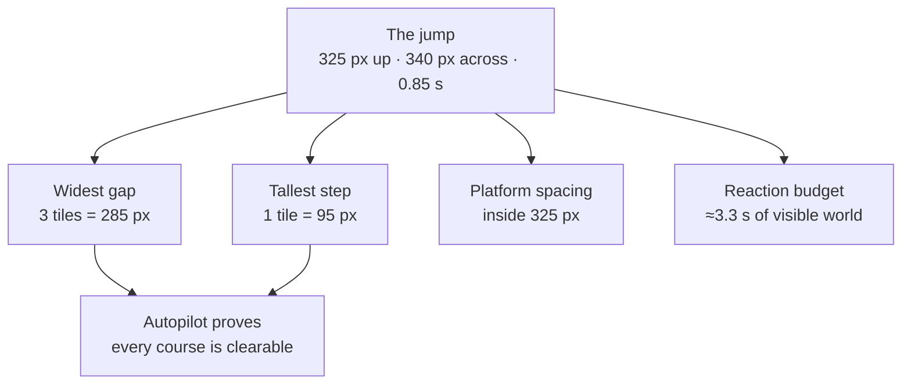

# 6. Walkthrough — the jump

One feature, followed all the way from an intention to a thing a player feels. The jump is the
right choice because in a runner it is the *only* verb: get it wrong and nothing else can be
right.

## 1. What the jump has to do

Before any number exists, the requirements:

- **Clear the widest gap** in the game, with margin.
- **Clear the tallest obstacle**, comfortably.
- **Respond instantly.** A runner is a timing game; late input is the whole failure mode.
- **Be forgiving** at the edges, where the player's belief and the game's state disagree.
- **Read clearly** — rising, falling and double-jumping must be distinguishable at a glance.

Note that these are in tension. A jump big enough to clear a wide gap hangs in the air, which
makes it feel sluggish. Resolving that tension *is* the design work.

## 2. Archaeology: what the original did

The original's entire vertical motion, in two lines of Java run once per drawn frame:

```java
speedY -= 1;                // gravity
setY(getY() + speedY);      // move
```

A jump set `speedY = 26`. So gravity was "one pixel per frame, per frame", and a jump was
"twenty-six pixels on the first frame".

Those are not physics units. They are **per-frame** units, which is the bug described in
[document 3](3-how-a-2d-game-works.md#why-the-clock-has-to-be-separate-from-the-picture): on a
144 Hz monitor the two lines run 144 times a second and Pepper's jump collapses to a hop.

But the *feel* those numbers produce is good, and it had been played and tuned by its author. The
task was to keep the feel and discard the frame dependency.

## 3. Converting to real units

Assume the original's intended 60 frames per second and convert:

| Quantity | Original | Converted | Check |
|---|---|---|---|
| Gravity | 1 px per frame² | **3,600 px/s²** | 3600 × (1/60)² = 1 px ✓ |
| Jump impulse | 26 px per frame | **1,560 px/s** | 1560 × (1/60) = 26 px ✓ |
| Terminal fall | 26 px per frame | **1,560 px/s** | same constant, reused |
| Run speed | — | **400 px/s** | already time-based |

Now the numbers are physical, and the simulation runs at a fixed **1/60 second** step. Because
the step matches the original's assumed frame rate exactly, the arithmetic reproduces the
original's integer sequence *precisely* — while no longer caring what the monitor does.

That is the whole trick: **fixed at 1/60 for fidelity, decoupled from drawing for correctness.**

## 4. The arithmetic — and the mistake that was actually made

How high does she go?

Each step: subtract gravity from velocity, then add velocity to position. Starting at 26 px per
step:

| Step | Velocity after gravity | Rises by |
|---|---|---|
| 1 | 25 | 25 px |
| 2 | 24 | 24 px |
| … | … | … |
| 25 | 1 | 1 px |
| 26 | 0 | 0 px |

Total: 25 + 24 + … + 1 = **325 px**, reached after 26 steps — **0.433 seconds**.

An early analysis of this project got that wrong and reported **351**, which is 26 + 25 + … + 1.
The difference is entirely **the order of the two lines**. Apply gravity first and the first step
moves 25; move first and it moves 26. Two lines of code, 26 pixels of jump height, and the
mistake is invisible unless you read the loop rather than the intention.

There is a second, subtler discrepancy worth knowing. The textbook formula for a projectile —
velocity squared over twice gravity — gives **338 px**, not 325:

> 1560² ÷ (2 × 3600) = 338

Neither number is wrong. 338 is the continuous answer; **325 is what a simulation taking discrete
1/60-second steps actually produces**. Games are discrete. When your designer's arithmetic
disagrees with the game by a few per cent, this is usually why.

> **The lesson:** trust the loop, not the formula, and not the summary. Then pin it down — this
> project asserts the apex in a test, so nobody can drift it by accident:
>
> *"matches the original: 325 px apex"* — [`src/sim/Runner.test.ts`](../src/sim/Runner.test.ts)

The full arc: up in 26 steps, down in about 26 more. **≈ 0.85 seconds** in the air, during which
the world moves 400 px/s × 0.85 s ≈ **340 px** — about **3.6 tiles**.

## 5. Making it feel good

The physics were now faithful. The feel still needed work, and every change here is a *departure*
from the original.

**Coyote time — 0.1 s.** Run off a ledge and, for a tenth of a second, a jump still works. The
original had none: one frame late and you were falling. Players do not perceive a sixtieth of a
second as their own error; they perceive it as the game ignoring them.

**Jump buffering — 0.12 s.** Press jump slightly before landing and the game remembers, firing
the instant she touches down. Without it, arriving early means nothing happens, which feels
exactly like a dropped input.

**The double-jump rule, rewritten.** The original allowed a second jump only while *still
rising*. Pass the top of your arc, or step off a ledge, and it was gone. That is a defensible
rule and it reads as a bug — the player has an ability, the ability is visibly available, and the
game silently refuses. Here, an air jump is available whenever you have one left.

None of these three was calculated. All were tuned by playing.

> **For designers:** these are the numbers to fight for. They cost little, they never appear in a
> feature list, and they are most of the difference between a game that feels responsive and one
> that feels cheap.

## 6. What the jump then decides

Once the envelope exists, it constrains everything downstream. This is the direction the
influence flows — **from the jump outward**, not from the level back:



- **Widest gap: 3 tiles, 285 px**, against 340 px of reach. The 55-pixel margin exists so that
  clearing it does not require a pixel-perfect takeoff.
- **Tallest obstacle: 1 tile, 95 px**, against a 325 px rise. So far inside the envelope that
  hitting one is unambiguously the player's mistake.
- **Falling faster than 1,560 px/s is impossible** — the same constant, reused as a terminal
  velocity. That is not a physical claim; it is a guarantee that she cannot move so far in one
  step that collision detection loses her.

## 7. Landing on things

The jump forced a decision about platforms, because a runner that bonks its head on every ledge
feels terrible.

Platforms here are **one-way**: you pass up through them and land on top. The original achieved
this with a rule that only counted a landing when falling slowly enough — which worked, but
carried a `FIXME` from its author, because a fast-moving player could pass straight through
between two frames.

This version tests **the whole path travelled since the last step** rather than just the
endpoint. If the feet crossed the surface at any point in between, that is a landing. Tunnelling
becomes impossible rather than merely unlikely, which is what allows the terminal velocity to be
a safety margin rather than a load-bearing hack.

## 8. Proving it works, three ways

A jump this central is verified at three levels, each catching what the others cannot:

**Arithmetic.** A test asserts the apex is 325 px and the airtime ≈0.85 s. Runs in milliseconds,
no browser. If anyone changes gravity, this fails immediately and says so.

**Playing.** The autopilot runs generated courses end to end. It cannot tell you the jump feels
good, but it can prove no course demands a jump that does not exist. It found three real flaws
this way — see [document 4](4-how-a-runner-works.md#validating-levels-automatically).

**Looking.** Add `?debug=1` to the game's URL and you get hitboxes, platform edges, the current
state, velocity, and the **measured arc of the jump you just made**. Not the theoretical arc —
the one that happened. When the number on screen disagrees with the number in the test, one of
them is lying and you can find out which.

> These are three different kinds of confidence. The test proves the maths. The bot proves the
> content. The overlay proves the two agree in reality. A project that only has the first is the
> project that ships dead buttons — see [document 2](2-building-it-with-ai.md).

## 9. What the player experiences

None of the above.

The player presses space. Pepper rises quickly and comes down with weight. A gap approaches and
they clear it with a little room. They step off a ledge a fraction late and the jump comes out
anyway. They press just before landing and it fires the moment she touches down. They reach for a
shelf, misjudge it, and use their second jump — which is there, because the game did not take it
away.

They will describe this as *responsive*, and they will not be able to tell you why.

That is the job. Every number in this document exists so that no player ever has to think about
any of them.

## The pattern, extracted

The sequence generalises to any core mechanic:

1. **State the requirements** before any number exists.
2. **Study prior art** — including its bugs, which are usually documented in the code.
3. **Convert to honest units** you can reason about.
4. **Do the arithmetic of your actual loop**, not the textbook. Check the ordering.
5. **Pin it with a test** so it cannot drift.
6. **Tune the feel separately from the physics.** Physics is correctness; feel is forgiveness.
7. **Derive your content limits from the mechanic**, never the reverse.
8. **Verify three ways**: maths, automation, and eyes.
9. **Hide all of it** from the player.

---

Back to [the reading path](README.md) · Play it: <https://wwstorymode.github.io/pepper-carrot-runner/>
